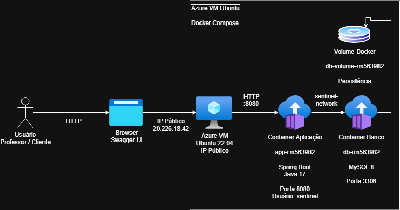

# Eclipse Sentinel - Global Solution 2026

## Integrantes

| Nome | RM |
|--------|--------|
| Felipe Augusto Lopes Ferreira | RM563982 |
| Kaique Mascarenhas dos Santos | RM565802 |

---

## Descrição da Solução

O Eclipse Sentinel é uma API REST desenvolvida em Java Spring Boot para monitoramento e prevenção de desastres naturais.

A solução permite o gerenciamento de:

- Usuários
- Áreas monitoradas
- Sensores
- Leituras de sensores
- Ocorrências
- Alertas

Todos os dados são persistidos em banco MySQL executando em container Docker separado.

A aplicação foi implantada em uma Máquina Virtual Microsoft Azure utilizando Docker Compose para orquestração dos containers.

---

# Arquitetura da Solução



Usuário → API Spring Boot → Banco MySQL

Infraestrutura:

- Azure Virtual Machine
- Container Docker da Aplicação
- Container Docker do Banco de Dados
- Rede Docker dedicada
- Volume Docker para persistência dos dados

# Tecnologias Utilizadas

- Java 17
- Spring Boot
- Spring Data JPA
- Spring Security
- MySQL 8
- Docker
- Docker Compose
- Swagger/OpenAPI
- Microsoft Azure

---

# Estrutura dos Containers

## Aplicação

Container:

```text
app-rm563982
```

Função:

```text
API Spring Boot
```

Porta:

```text
8080
```

Usuário:

```text
sentinel
```

---

## Banco de Dados

Container:

```text
db-rm563982
```

Função:

```text
MySQL 8
```

Porta:

```text
3306
```

Volume:

```text
db-volume-rm563982
```

---

# Como Executar o Projeto

### 1. Clonar o Repositório

```bash
git clone https://github.com/FelipeAugusto99/EclipseSentinel-GS2026-DEVOPS.git
```

---

### 2. Entrar na Pasta do Projeto

```bash
cd EclipseSentinel-GS2026-DEVOPS
```

---

### 3. Criar a Infraestrutura Azure

Executar dentro da pasta do repositório o script responsável pela criação da VM e recursos na Azure:

```bash
azure/criacao.sh
```

---

### 4. Conectar na Máquina Virtual Azure

Substitua pelo IP da sua VM:

```bash
ssh azureuser@SEU_IP_PUBLICO
```

Exemplo:

```bash
ssh azureuser@20.226.18.42
```

---

### 5. Clonar o Repositório Dentro da VM

```bash
git clone https://github.com/FelipeAugusto99/EclipseSentinel-GS2026-DEVOPS.git
```

---

### 6. Entrar na Pasta do Projeto na VM

```bash
cd EclipseSentinel-GS2026-DEVOPS
```

---

### 7. Verificar Docker

```bash
docker --version
docker compose version
```

---

### 8. Construir e Executar os Containers

```bash
docker compose up -d --build
```

### 8.1 Caso a porta 8080 já esteja em uso

Se aparecer o erro `port is already allocated`, execute:

```bash
sudo docker rm -f nginx-8080
sudo docker compose up -d
```

---

### 9. Verificar Containers em Execução

```bash
docker ps
```

Resultado esperado:

```text
app-rm563982
db-rm563982
```

---

### 10. Exibir Logs dos Containers

Logs da aplicação:

```bash
docker logs app-rm563982
```

Logs do banco:

```bash
docker logs db-rm563982
```

---

### 11. Testar a API

Swagger:

```text
http://SEU_IP_PUBLICO:8080/swagger-ui/index.html
```

Exemplo:

```text
http://20.226.18.42:8080/swagger-ui/index.html
```

---

### 12. Acessar o Container da Aplicação

```bash
docker exec -it app-rm563982 sh
```

Verificar usuário:

```bash
whoami
```

Verificar diretório:

```bash
pwd
```

Listar arquivos:

```bash
ls -la
```

Sair:

```bash
exit
```

---

### 13. Acessar o Container do Banco

```bash
docker exec -it db-rm563982 sh
```

Verificar usuário:

```bash
whoami
```

Verificar diretório:

```bash
pwd
```

Listar arquivos:

```bash
ls -la
```

Sair:

```bash
exit
```

---

### 14. Conectar ao MySQL

```bash
docker exec -it db-rm563982 mysql -u root -proot123
```

Selecionar banco:

```sql
USE eclipse_sentinel;
```

Listar tabelas:

```sql
SHOW TABLES;
```

Consultar usuários:

```sql
SELECT * FROM gs_eclipse_usuario;
```

Consultar áreas:

```sql
SELECT * FROM gs_eclipse_area;
```

Consultar sensores:

```sql
SELECT * FROM gs_eclipse_sensor;
```

Sair:

```sql
EXIT;
```

---

### 15. Encerrar os Containers

```bash
docker compose down
```

---

### 16. Remover a Infraestrutura Azure

Após finalizar os testes e validações, abrir um NOVO terminal/Bash local, acessar a pasta do projeto e executar:

```bash
azure/deletar.sh
```

---

# Documentação da API

Swagger UI:

```text
http://SEU_IP_PUBLICO:8080/swagger-ui/index.html
```

Exemplo:

```text
http://20.226.18.42:8080/swagger-ui/index.html
```

---
## Exemplo de Teste

### Criar Usuário

POST /usuarios

```json
{
  "nome": "Admin",
  "email": "admin@teste.com",
  "senha": "123456",
  "role": "ADMIN"
}
```

---
# Vídeo Demonstrativo

Link do YouTube:

```text
https://youtu.be/CX8DJgpLGCY
```

---

# Repositório GitHub

```text
https://github.com/FelipeAugusto99/EclipseSentinel-GS2026-DEVOPS
```
